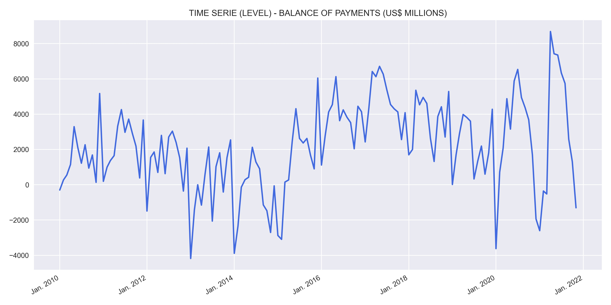

# **DESCRIPTION**
Balance of Payments (BOP)

The balance of payments (BOP), also known as the balance of international payments, is a statement of all transactions made between entities in one country and the rest of the world over a defined period, such as a quarter or a year. It summarizes all transactions that a country's individuals, companies, and government bodies complete with individuals, companies, and government bodies outside the country.

Source: https://www.bcb.gov.br/

# **RESULTS**
Results obtained through the model estimation process.

## Variable analysis at level:
    

    

    

    

## Study of data stationarity:
    

    

## SEASONAL ADJUSTMENT:
    

    

## Model results:
    

## Residual analysis:
    

    

    

# FORECAST:
    
